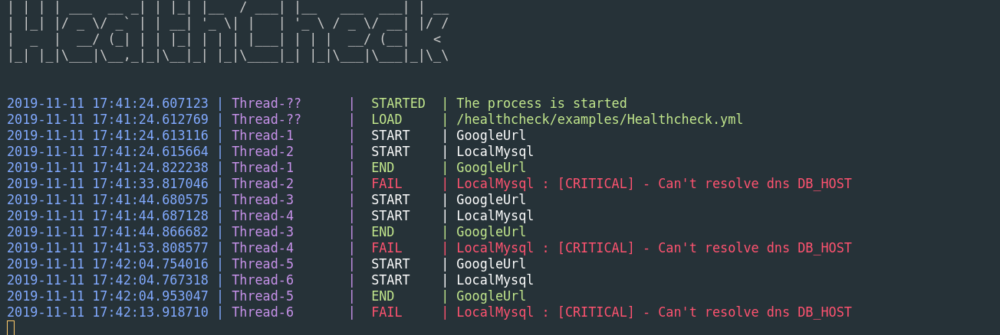

# HEALTHCHECK

Simple healthcheck service created in python

**The project still in the design step.**

## Table of Contents
* [Next-step](#next-step-)
* [Container](#container-)
  * [Container info](#container-info-)
* [INSTRUCTIONS](#instructions-)
  * [Execution](#execution-)
  * [Config file](#config-file-)
  * [Modules](#modules-)
* [SCREENSHOT](#screenshot-)
* [VERSION History](#version-history-)
* [Author](#author-)
* [Mentions](#mentions-)

## Next-step 

Created more modules and a frontend to visualize the healthcheck from a website.

## Container 
If you want, you can use a container image allocated in the  [DockerHub](https://hub.docker.com/r/rdcarrera/healthcheck/)

The container accept a ENV: __CONFIG_PATH__ where you can pass the healthcheck config file path.

I recommend to mount an external volume for the config of the healthcheck and modules, and another one to mount the history folder to save all the state changes.

### Container info 

<table>
        <tr>
            <th colspan=3>
<b>Container Info</b></th>
        </tr>
        <tr>
            <td><b>Container Engine</td>
            <td><b>Operation System</td>
            <td><b>Tecnology</td>
        </tr>
        <tr>
            <td rowspan=1>
</td>
            <td rowspan=1>
 </td>
            <td></td>
        </tr>
</table>

## INSTRUCTIONS 

### Execution 

The proccess accept a the param __-c__ or __--config__ where you have to pass the path of the config file.

### Config file 

The config file has 2 parts:

###  __config__

Here you can configure the proccess:

- __default_seconds_interval__

The default time to wait in seconds between iteration to check the tasks

- __default_proccess_wait_time__

The engine is in an infinity loop, this param configure the time to wait between iterations of the sequence.

- __default_retry_on_faults__

The number of try before to accept an non ok in a check.

- __default_max_history_data__

The maximun number of state changes saved in the history file.

- __default_history_folder__

The folder where are allocated the history files.

- __default_config_folder__

The folder where are allocated the configuration of the tasks.

- __default_lock_folder__

The folder where are allocated the specific lock file of the task for the threadings.

###  __tasks__
Here you're going to define a list of task.

- __name__

The name of the tasks, this name would be the same as the config file.

- __module__

The module what you're going to use.

- __seconds_interval__

The time to wait in seconds between iteration to check this task

### Modules 

- This proccess is develop in a module mind, all the different check are modules __(actually only one has been develop [HttpGetString])__

- All the modules could have different configuration style (but everything in a yaml file)

## SCREENSHOT 

## VERSION History 
[VERSION History](VERSION.md)

## Author 

## Mentions 
Arrow logo taken from: https://www.flaticon.com/free-icon/up-arrow_23714
